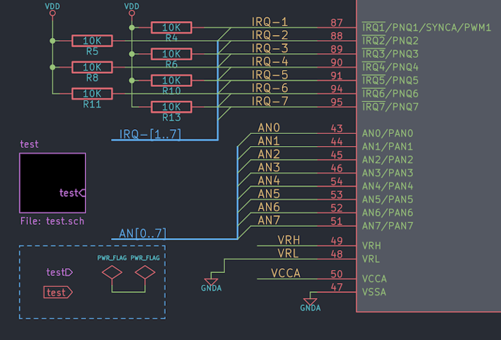
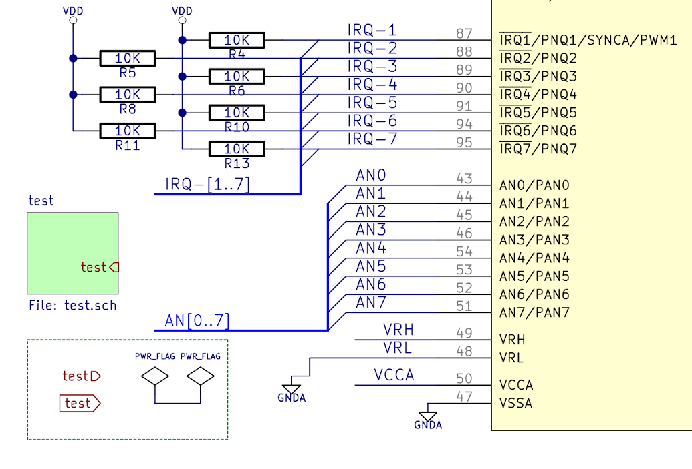

# kicad-color-schemes

Want to change the color scheme of KiCad? Look here for inspiration.

## Install Color Themes using the PCM (KiCad 5.99 demo feature)

If you run KiCad 5.99 which was build including the new Plugin and Content Manager (using the compile option `-DKICAD_PCM=ON`), you can simply add the repository url and install the themes inside KiCad:
- https://raw.githubusercontent.com/pointhi/kicad-color-schemes/master/repository.json

## How to use a colour theme.

Every theme directory contains the colour definition parts of the eeschema and pcbnew setup files found in your personal profile.
- For Linux under ~.config/kicad/
- Windows XP: “C:\Documents and Settings\username\Application Data” + kicad (= %APPDATA%\kicad)
- Windows Vista & later: “C:\Users\username\AppData\Roaming” + kicad (= %APPDATA%\kicad)
- OSX: The user’s home directory + /Library/Preferences/kicad

Use a text editor to overwrite the relevant sections with the data found in the files in this folder. **Make sure you create a backup first.**

The pcbnew config file content has been split into the sections responsible for the footprint editor and the one for pcbnew. This is done to allow you to more easily mix and match different schemes for different tools.

## Automatic patcher

An automatic patch script can be used to transfer a colour scheme into your KiCad settings files. Make sure KiCad is closed before using it.

The script expects the directory containing the colour scheme and the kicad config directory as arguments. Switches are included to disable transfer of a particular part of the scheme definition. (use --help for detailed instructions.) A bakup of your settings files is created before changes are made.

Example:
`python3 patch.py ~/kicad-color-schemes/blue-green-dark/ ~/.config/kicad/`

## JSON themes (for KiCad 6, and "5.99" nightly builds after February 2020)

KiCad 6 is changing to a JSON-based colour theme system.  Recent nightly builds already support the
new system, where each colour theme lives in a JSON file in the `colors` directory of the user
settings path (see "How to use a colour theme" above.)

To use the JSON version of a theme, just copy the file into your `colors` directory.  The next time
you run KiCad, it will detect the new theme file and you will be able to choose it in the
preferences.  Each KiCad application can use a different color theme if you wish.

In the new system, the footprint editor and PcbNew use the same color theme.  If you would like to
have different colours for those two applications, the way to do it is to choose a different theme
file in the PcbNew and footprint editor preferences dialogs.

## eeschema

| color-scheme                                               | screenshot                                                                                                                                  |
| ---------------------------------------------------------- | ------------------------------------------------------------------------------------------------------------------------------------------- |
| **kicad-classic**                                          |  |
| **kicad-2020**                                             |                 |
| **solarized-dark** *http://ethanschoonover.com/solarized*  |           |
| **solarized-light** *http://ethanschoonover.com/solarized* |         |
| **black-white**                                            |                   |
| **blue-tone**                                              |                              |
| **behave-dark** *https://atom.io/themes/behave-theme*      |                 |
| **neon** *Inspired by forum user BobZ*                     |   |
| **nord** *Designed by @0xdec*                              |              |
| **monokai** *Inspired by forum user kickofighto*           |                    |
| **eagle-dark** *Designed by DX-MON, Inspired by EagleCAD*  |                   |
| **wdark** *Designed by wykys, Inspired by One Dark*        |                                                                              |
| **wlight** *Designed by wykys, Inspired by Altium*         |                                                                               |

## pcbnew
| color-scheme                                              | screenshot                                                                                                                                |
| --------------------------------------------------------- | ----------------------------------------------------------------------------------------------------------------------------------------- |
| **kicad-classic**                                         |  |
| **kicad-2020**                                            |                 |
| **behave-dark** *https://atom.io/themes/behave-theme*     |                 |
| **blue-green-dark**                                       |        |
| **nord** *Designed by @0xdec*                             |              |
| **eagle-dark** *Designed by DX-MON, Inspired by EagleCAD* |         |

## footprint editor
| color-scheme                                              | screenshot                                                                                                                                          |
| --------------------------------------------------------- | --------------------------------------------------------------------------------------------------------------------------------------------------- |
| **kicad-classic**                                         |  |
| **kicad-2020**                                            |                 |
| **behave-dark** *https://atom.io/themes/behave-theme*     |                 |
| **blue-green-dark**                                       |        |
| **nord** *Designed by @0xdec*                             |              |
| **eagle-dark** *Designed by DX-MON, Inspired by EagleCAD* |         |
