# kicad-color-schemes

Want to change the color scheme of KiCad? You've come to the right place!

## How to select & install a theme

The instructions below assume the following:
* The user is using a command line interface (CLI).
* The user has Python3 installed. 

1. Clone this repository.

```bash
git clone https://github.com/pointhi/kicad-color-schemes.git
```

2. Close KiCad. Note: **The theme will not be updated unless KiCad is closed**.
3. Navigate into the top-level of the cloned repository.
4. Enter `make` or `make theme` in the CLI. 
5. Select the number corresponding to the theme you wish to install.
6. Start KiCad and enjoy your new theme!

## How it works

User settings for the `eeschema` schematic editor, `pcbnew` layout tool, and the footprint editor are
all stored in user preference files called `eeschema` and `pcbnew` (without file extensions). The
specific keys within those files that correspond to visual appearance for the tool is done through the
. At the preference
file-level, this would look like: `Color4DPinNameEx=rgb(67, 76, 94)`. By changing the red/green/blue
color values, the appearance of a given element can be changed. 

The **kicad-color-schemes** scripts automatically apply user-selected themes through the following:
1. The Makefile `theme` target calls the `theme_selection.py` script.
2. The `theme_selection.py` script automatically makes backups of available user preference files.
   Note: These files are kept in the same directory as the originals, but with a `.bak` extension. 
3. The `theme_selection.py` script scans the `themes` directory and finds all available themes. 
4. Identified themes are displayed to the user where the user enters a number selection corresponding
   to a theme. 
5. `patch.py` is called to set the selected theme for all supported tool elements that theme has available.

As an important note: **Not all themes contain support for all tool elements**.
For example, `base16_dracula` currently only has support for the eeschema tool, so pcbnew and footprint editor
will continue to look the same. 

If you would like to see the limited themes grow and have more effect, please consider supporting this project
by adding configurations for our currently limited themes!

## Manually settings themes

There may be cases where the user wishes to set the themes manually. These may include:

* Running an unsupported operating system or custom KiCad installation which results in 
  the scripts being unable to automatically find the user preference files.
* Wanting to set different themes for eeschema, pcbnew, and footprint editor. 
* Wanting to supply a custom theme from another directory 
  (Note: New themes can be included simply by adding a new folder to the `themes` directory)

Regardless of the specific reason, the user is able to call the `patch.py` script with arguments to the
selected theme folder as well as the user preference configuration folder. The following code block
demonstrates this:

```bash
# From the top-level of the cloned repository
python3 scripts/patch.py <themes/selected-theme/> <path/to/your/eeschema/folder/>
```

Some optional arguments are also available: 

Optional Argument          | Description
-------------------------- | ------------
`-e`,`--eeschema_disable`  | Disable updating the theme of the schematic editor
`-f`,`--footprint_disable` | Disable updating the theme of the footprint editor
`-p`,`--pcb_disable`       | Disable updating the theme of the PCB editor

## JSON themes (for KiCad 6, and "5.99" nightly builds after February 2020)

KiCad 6 is changing to a JSON-based colour theme system.  Recent nightly builds already support the
new system, where each colour theme lives in a JSON file in the `colors` directory of the user
settings path (see "How to use a colour theme" above.)

To use the JSON version of a theme, just copy the file into your `colors` directory.  The next time
you run KiCad, it will detect the new theme file and you will be able to choose it in the
preferences.  Each KiCad application can use a different color theme if you wish.

In the new system, the footprint editor and PcbNew use the same color theme.  If you would like to
have different colours for those two applications, the way to do it is to choose a different theme
file in the PcbNew and footprint editor preferences dialogs.

## eeschema

color-scheme                                               | screenshot
-----------------------------------------------------------|-----------
**base16_dracula** *[From skalidindi3](https://github.com/skalidindi3/kicad-colors)* | ![base16_dracula eeschema][base16_dracula-eeschema-link]
**base16_nord** *[From skalidindi3](https://github.com/skalidindi3/kicad-colors)* | ![base16_nord eeschema][base16_nord-eeschema-link]
**base16_oceanicnext** *[From skalidindi3](https://github.com/skalidindi3/kicad-colors)* | ![base16_oceanicnext eeschema][base16_oceanicnext-eeschema-link]
**base16_onedark** *[From skalidindi3](https://github.com/skalidindi3/kicad-colors)* | ![base16_onedark eeschema][base16_onedark-eeschema-link]
**base16_rebecca** *[From skalidindi3](https://github.com/skalidindi3/kicad-colors)* | ![base16_rebecca eeschema][base16_rebecca-eeschema-link]
**behave-dark** *[Behave Theme](https://atom.io/themes/behave-theme)* | ![behave-dark eeschema][behave-dark-eeschema-link]
**blue-tone** | ![blue-tone eeschema][blue-tone-eeschema-link]
**eagle** *Designed by DX-MON, Inspired by EagleCAD* | ![eagle eeschema][eagle-eeschema-link]
**handpicked_nord** *[Nord](https://github.com/arcticicestudio/nord-vim/blob/develop/colors/nord.vim)* | ![handpicked_nord eeschema][handpicked_nord-eeschema-link]
**handpicked_onedark** *[Onehalf Dark](https://github.com/sonph/onehalf/blob/master/vim/colors/onehalfdark.vim)* | ![handpicked_onedark eeschema][handpicked_onedark-eeschema-link]
**kicad-2020** | ![kicad-2020 eeschema][kicad-202-eeschema-link]
**kicad-classic** | ![kicad-classic eeschema][kicad-classic-eeschema-link]
**monokai** *Inspired by forum user kickofighto* | ![monokai eeschema][monokai-eeschema-link]
**neon** *Inspired by forum user BobZ* | ![neon eeschema][neon-eeschema-link]
**nord** *Designed by @0xdec* | ![nord eeschema][nord-eeschema-link]
**solarized-dark** *[Solarized](http://ethanschoonover.com/solarized)* | ![solarized-dark eeschema][solarized-dark-eeschema-link]
**solarized-light** *[Solarized](http://ethanschoonover.com/solarized)* | ![solarized-light eeschema][solarized-light-eeschema-link]
**sw** | ![sw eeschema][sw-eeschema-link]

## pcbnew
color-scheme                                               | screenshot
-----------------------------------------------------------|-----------
**kicad-classic** | 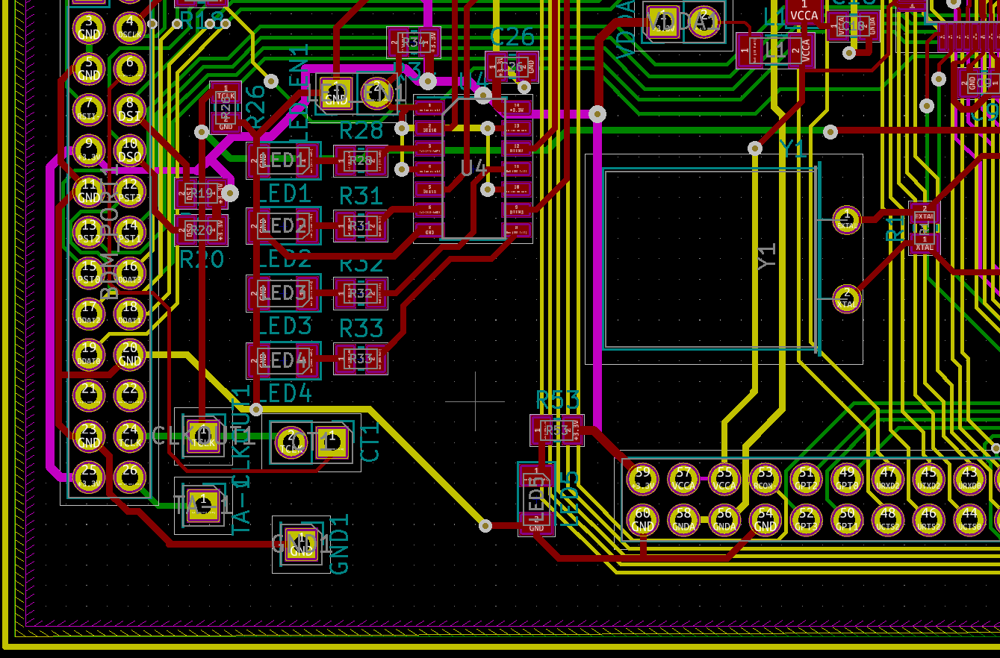
**kicad-2020** | 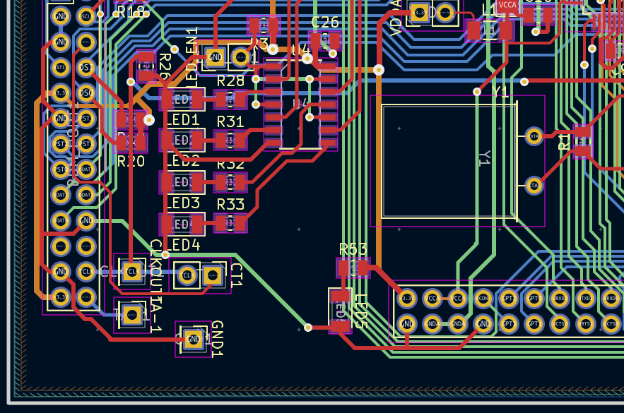
**behave-dark** *https://atom.io/themes/behave-theme* | 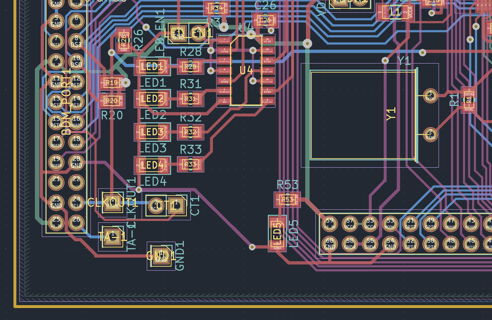
**blue-green-dark** | 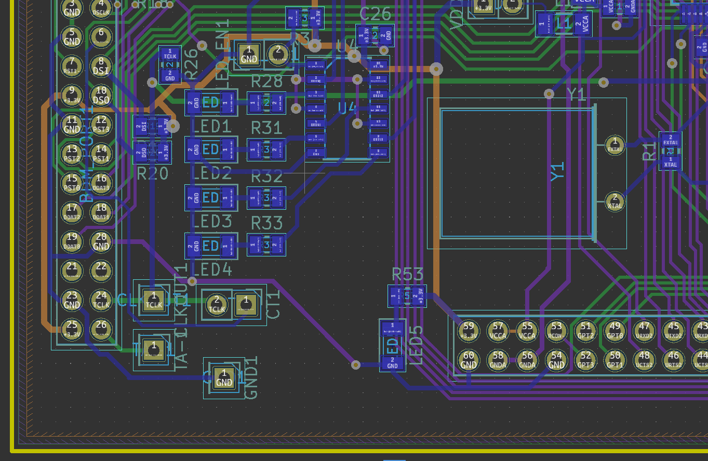
**nord** *Designed by @0xdec* | 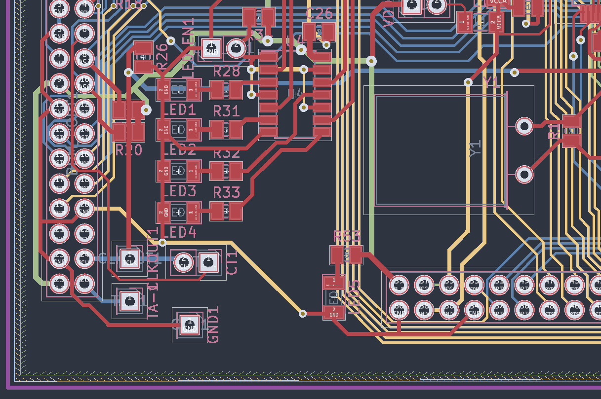
**eagle** *Designed by DX-MON, Inspired by EagleCAD* | 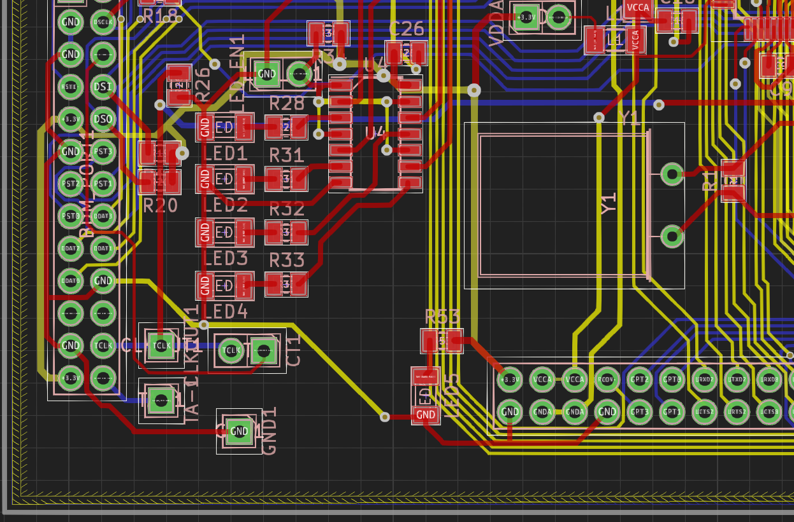

## footprint editor
color-scheme                                               | screenshot
-----------------------------------------------------------|-----------
**kicad-classic** | 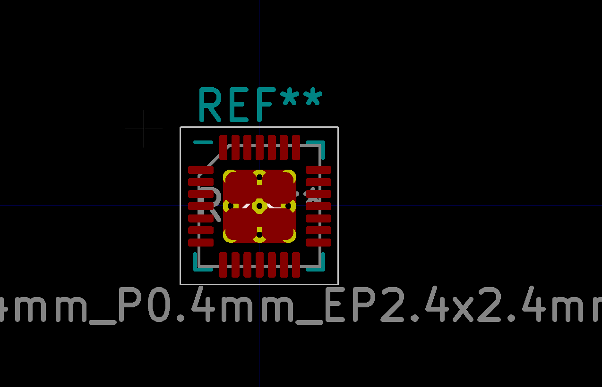
**kicad-2020** | 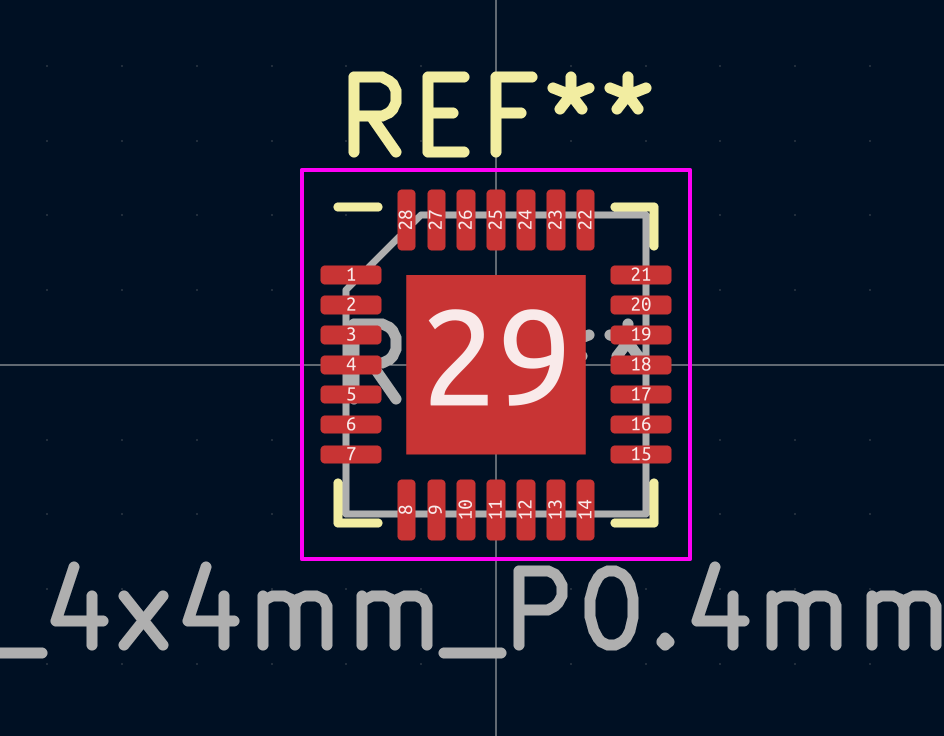
**behave-dark** *https://atom.io/themes/behave-theme* | 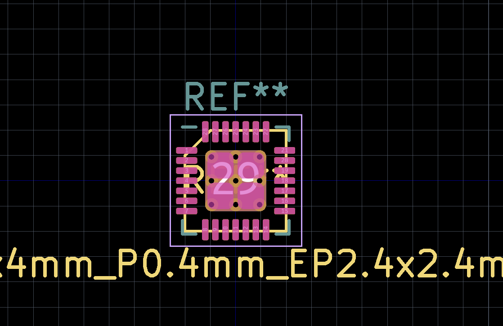
**blue-green-dark** | 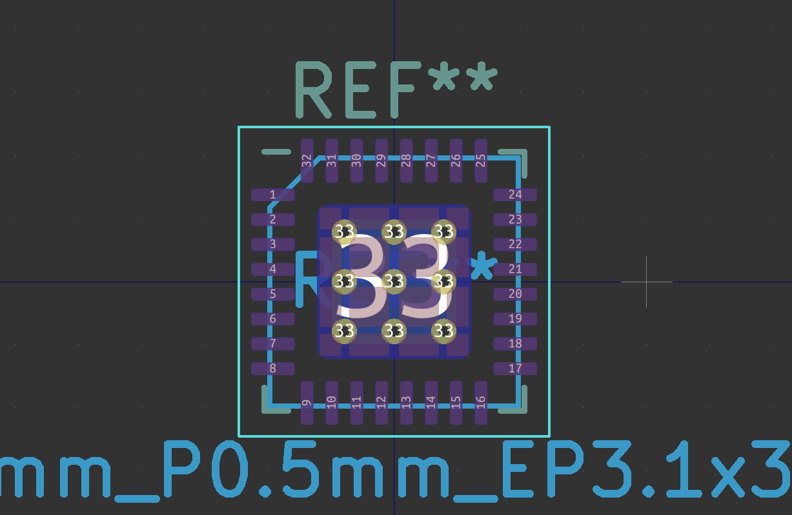
**nord** *Designed by @0xdec* | 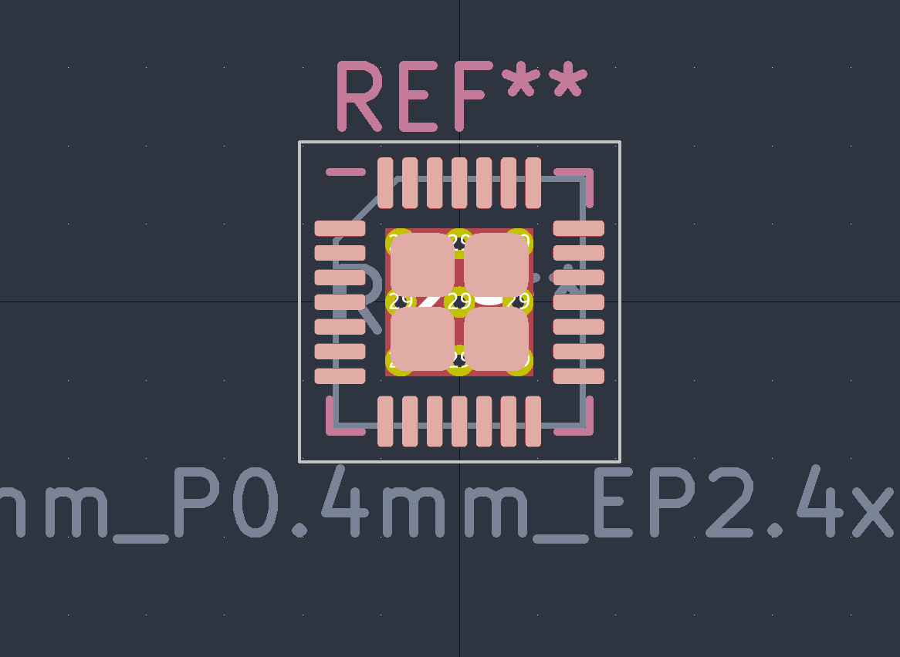
**eagle** *Designed by DX-MON, Inspired by EagleCAD* | 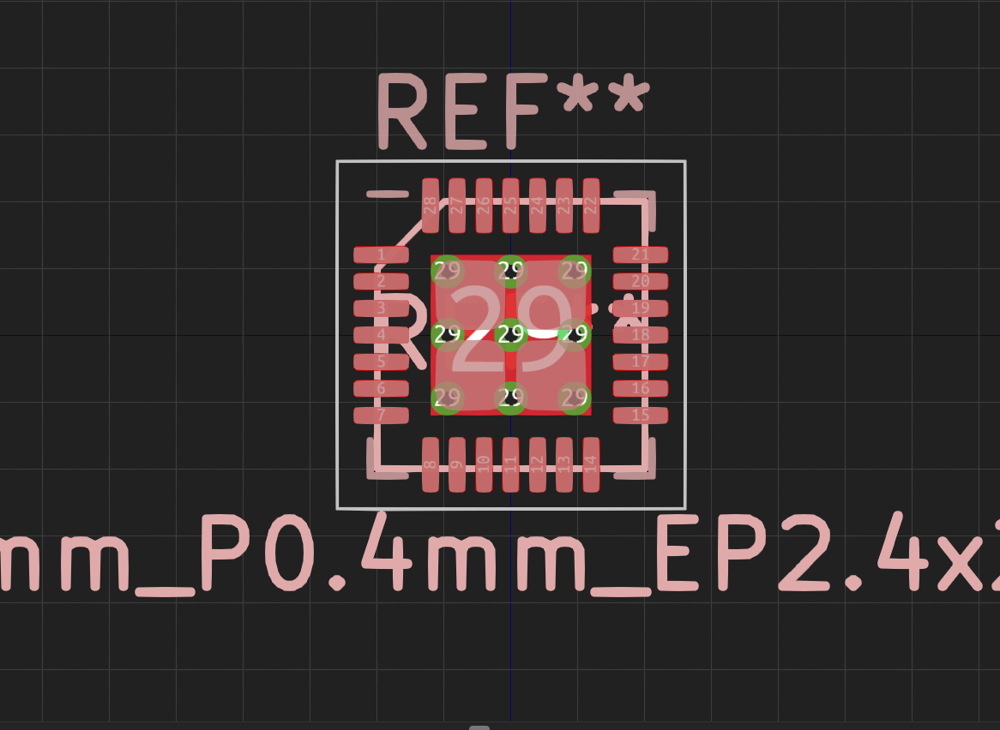


[base16_dracula-eeschema-link]: https://raw.githubusercontent.com/ddm9599/kicad-color-schemes/master/themes/base16_dracula/eeschema.png
[base16_nord-eeschema-link]: https://raw.githubusercontent.com/ddm9599/kicad-color-schemes/master/themes/base16_nord/eeschema.png
[base16_oceanicnext-eeschema-link]: https://raw.githubusercontent.com/ddm9599/kicad-color-schemes/master/themes/base16_oceanicnext/eeschema.png
[base16_onedark-eeschema-link]: https://raw.githubusercontent.com/ddm9599/kicad-color-schemes/master/themes/base16_onedark/eeschema.png
[base16_rebecca-eeschema-link]: https://raw.githubusercontent.com/ddm9599/kicad-color-schemes/master/themes/base16_rebecca/eeschema.png
[behave-dark-eeschema-link]: https://raw.githubusercontent.com/ddm9599/kicad-color-schemes/master/themes/behave-dark/eeschema.png
[blue-tone-eeschema-link]: https://raw.githubusercontent.com/ddm9599/kicad-color-schemes/master/themes/blue-tone/eeschema.png
[eagle-eeschema-link]: https://raw.githubusercontent.com/ddm9599/kicad-color-schemes/master/themes/eagle/eeschema.png
[handpicked_nord-eeschema-link]: https://raw.githubusercontent.com/ddm9599/kicad-color-schemes/master/themes/handpicked_nord/eeschema.png
[handpicked_onedark-eeschema-link]: https://raw.githubusercontent.com/ddm9599/kicad-color-schemes/master/themes/handpicked_onedark/eeschema.png
[kicad-202-eeschema-link]: https://raw.githubusercontent.com/ddm9599/kicad-color-schemes/master/themes/kicad-2020/eeschema.png
[kicad-classic-eeschema-link]: https://raw.githubusercontent.com/ddm9599/kicad-color-schemes/master/themes/kicad-classic/eeschema.png
[monokai-eeschema-link]: https://raw.githubusercontent.com/ddm9599/kicad-color-schemes/master/themes/monokai/eeschema.png
[neon-eeschema-link]: https://raw.githubusercontent.com/ddm9599/kicad-color-schemes/master/themes/neon/eeschema.png
[nord-eeschema-link]: https://raw.githubusercontent.com/ddm9599/kicad-color-schemes/master/themes/nord/eeschema.png
[solarized-dark-eeschema-link]: https://raw.githubusercontent.com/ddm9599/kicad-color-schemes/master/themes/solarized-dark/eeschema.png
[solarized-light-eeschema-link]: https://raw.githubusercontent.com/ddm9599/kicad-color-schemes/master/themes/solarized-light/eeschema.png
[sw-eeschema-link]: https://raw.githubusercontent.com/ddm9599/kicad-color-schemes/master/themes/sw/eeschema.png